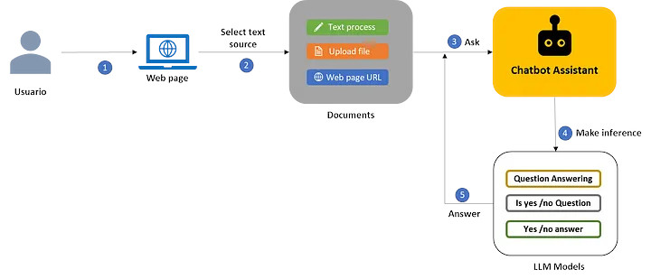
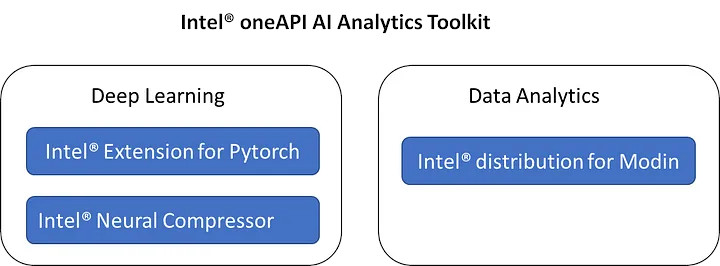
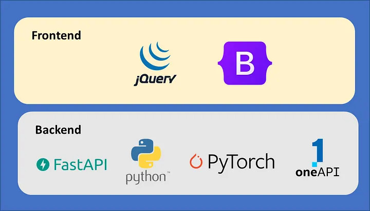
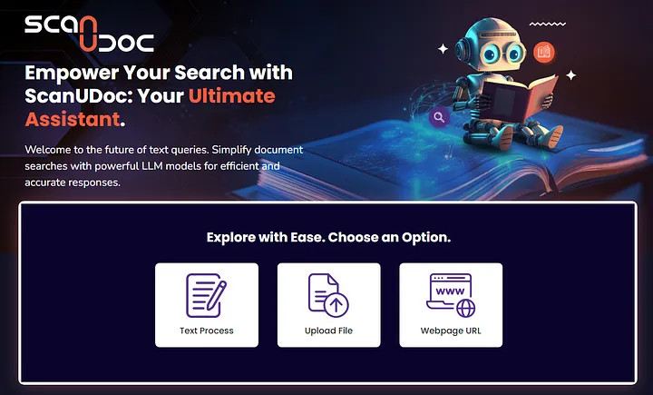
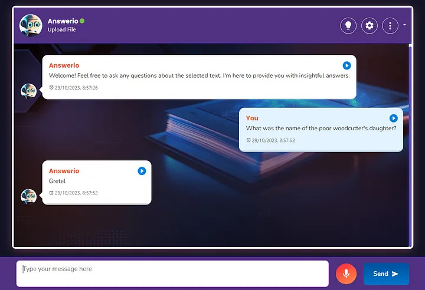

# ScanUDoc

**Intel® oneAPI Hackathon 2023: The LLM Challenge**

Live Demo - [https://huggingface.co/spaces/roaltopo/scan-u-doc]()

Blog - [https://medium.com/@roaltopo/unleashing-textual-understanding-with-scanudoc-f2e12499ae11]()

Author: [https://www.linkedin.com/in/rodolfo-torres-p]()

---

### Proposed Solution

**ScanUDoc** is an innovative chatbot application born during the competitive atmosphere of the **Hackathon oneAPI: The LLM Challenge**. In the midst of today's information overload, our focus is on effortlessly extracting valuable insights from extensive textual data.

Experience the convenience of an assistant that navigates complex documents, precisely answers queries, and effortlessly provides relevant information, simplifying the tedious process of reviewing extensive text. With ScanUDoc, powered by advanced LLM models, obtaining contextual information has never been smoother.

Our aim in this challenge was not only to create an advanced natural language processing system but also to expand the capabilities of existing language models. Leveraging Intel® oneAPI technology, we've developed a virtual assistant that revolutionizes interaction with large text datasets in ways we never thought possible.

### **Detailed process flow**



At the core of **ScanUDoc** are Language Model (LLM) models, meticulously trained to process text with precision. During development, three key models were refined for an advanced question-answering system:

1. **Question Answering (QA) Model**: Based on deepset/roberta-base-squad2, this model precisely locates answers within the context, providing relevant responses.
2. **Yes / No Question Classification Model**: With distilbert-base-uncased, ScanUDoc swiftly detects if a question warrants a simple "yes" or "no" response, enhancing user experience.
3. **Yes / No Choice Model:** This model evaluates provided options to determine if the answer is "Yes" or "No," ensuring coherence and efficiency.

### **Technology Stack**



The optimization approach has relied on the following tools from the **Intel® AI Analytics Toolkit**:

1. **Intel® Extension for PyTorch**: Crucial for training and optimizing LLM model inference, enhancing accuracy and processing efficiency for large-scale text.
2. **Intel® Neural Compressor:** Integrated to further optimize model inference, enabling more efficient use of resources and faster response times.
3. **Intel® Distribution for Modin:** Essential for initial data analysis, facilitating efficient data exploration and enabling agile development of ScanUDoc.

### **Architecture Diagram**



1. **Interactive Front-end:** The ScanUDoc front-end combines HTML, Bootstrap, and jQuery to create a user-friendly interface, promoting easy interaction with the system and access to essential chatbot functionalities.
2. **Efficient Back-end:** The back-end development utilizes FastAPI, creating a robust system that rapidly and accurately processes user queries. It consults LLM models to deliver contextual and precise responses, ensuring a smooth user experience.

### **Application Screenshoots**




### Project Structure

**scan-u-doc**

├─── assets        # Images

├─── models        # Trained LLM models

└─── webapp        # Web application enabled for Docker deployment

### **Step-by-step instructions for deploying the solution**

* Ensure that you have installed both dockerMake sure you have already installed docker ([https://docs.docker.com/get-docker/](https://docs.docker.com/get-docker/)) and docker-compose ([https://docs.docker.com/compose/](https://docs.docker.com/compose/)).
* Clone the Repository

```python
$ git clone https://github.com/roaltopo/scan-u-doc
 $ cd scan-u-doc
```

* Start the webapp demo.

```python
# Docker command: build and start containers.
  $ docker-compose up --build
```

* Go to:[http://localhost:7860]()


### **Key Learnings**

1. Training LLM models to deliver accurate and context-aware responses by leveraging their text generation and comprehension capabilities.
2. Implementing applications on the OneApi platform and optimizing AI software using the Intel® AI Analytics Toolkit.
3. Creating a chatbot application that integrates with pre-trained LLM models and deploying it on a publicly accessible webpage.
